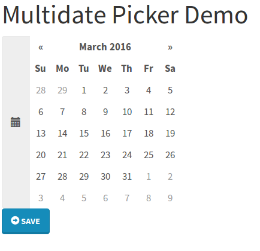
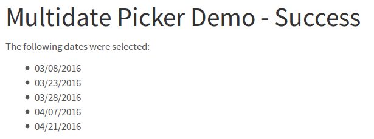

django-bootstrap3-datepicker
============================

Datepicker that supports the selection of multiple dates for Django,
using Bootstrap Twitter.

The aim of this package is to provide widgets and form fields for Django
that use
`bootstrap-datepicker <http://bootstrap-datepicker.readthedocs.org/en/latest/index.html>`__.

There are some packages that already try to do this, however I've never
found one with working multidate support. The package's homepage can be
found
`here <https://github.com/FabianWe/django-bootstrap3-multidatepicker>`__
on GitHub.

I'll slightly follow the package as provide
`here <https://github.com/nkunihiko/django-bootstrap3-datetimepicker>`__.
This package supports single date selection, mine will cover multidate
selection. Because that's not so much change I'll actually copy a lot
from this code base.

Notice
======

This package does what I want for a specific purpose, if you have any
suggestions contact me! This package is still in an early beta.

Credits
=======

I've used some libraries and I wish to thank the people who wrote them!
\* Of course the `Django <https://www.djangoproject.com/>`__ developers
\*
`bootstrap3\_datepicker <http://bootstrap-datepicker.readthedocs.org/en/latest/index.html>`__
\* `JavaScript Date
Format <http://blog.stevenlevithan.com/archives/date-time-format>`__

And all the people I've forgotten ;).

License
=======

Licensed under the `Apache License, Version
2.0 <http://www.apache.org/licenses/LICENSE-2.0>`__.

Example Usage
=============

There is a small demo included in this package. However make sure that
``'django_bootstrap3_multidatepicker'`` and ``'bootstrap3'`` are
contained in your ``'INSTALLED_APPS'``.

You should also change the bootstrap3 default behaviour and take care
that ``'javascript_in_head'`` is set to ``True``, i.e. put in your
*settings.py*:

.. code:: python

    BOOTSTRAP3 = {
        'javascript_in_head': True,
    }

There is a widget called ``BootstrapDatepickerInput`` and a form field
``DateListField``. They should be used together, otherwise I can't
guarantee anything ;).

The ``DateListField`` stores the dates as python list of
``datetime.date`` objects. The hidden input stores a json list
containing all the selected dates in the form ``"yyyy/mm/dd"``, e.g.
``"2016/02/22"``. It's method ``to_python`` gets the string from the
hidden input, tries to parse them in the given format and returns the
list of all dates.

Here's a small example that displays a calendar and lets the user select
the inputs.

.. code:: python

    from django import forms

    from from django_bootstrap3_multidatepicker.django_bootstrap3_multidatepicker import widgets, fields import widgets, fields

    class YourForm(forms.Form):
        dates = fields.DateListField(label='Select Dates')

Adding a template etc. will give you a calendar like this:

   Example of the widget
A view could look like this:

.. code:: python

    class MultiDateForm(FormView):
        template_name = YourTemplate
        form_class = YourForm

        def form_valid(self, form):
            dates = form.cleaned_data['dates']
            return render(self.request, YourSuccessTemplate, {'dates': dates})

In YourSuccessTemplate you can do something like this:

.. code:: html

    The following dates were selected:

    
    <ul>
      
        <li>{{ date|date:"SHORT_DATE_FORMAT" }}</li>
      
    </ul>
    

Your result will look something like this: |Success page|

