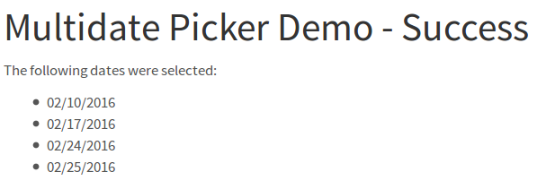

Quickstart
**********

Configure Django
================

There is a small demo included in this package.
However make sure that
``django_bootstrap3_multidatepicker.django_bootstrap3_multidatepicker`` and
``bootstrap3`` are contained in your ``INSTALLED_APPS``.

You should also change the bootstrap3 default behaviour and take care that
``javascript_in_head`` is set to ``True``, i.e. put in your settings.py:

.. code-block:: python

  BOOTSTRAP3 = {
    'javascript_in_head': True,
  }

There is a widget called ``BootstrapDatepickerInput`` and a form field ``DateListField``.
They should be used together, otherwise I can't guarantee anything ;).

The widget creates a HiddenInput field that stores a json list containing all the
selected dates in the form ``"yyyy/mm/dd"``, e.g. ``"2016/02/22"``.

The field's ``to_python`` method gets the string from the hidden input, tries to parse them
in the given format and returns the list of all dates.

Create a Form
=============

Here's a small form example that displays a calendar and lets the user select the inputs:

.. code-block:: python

  from django import forms

  from from django_bootstrap3_multidatepicker.django_bootstrap3_multidatepicker import widgets, fields

  class YourForm(forms.Form):
    dates = fields.DateListField(
          label='Select Dates',
          widget=widgets.BootstrapDatepickerInput(
              js_var='bootstrap_picker',
              options={
                  'clearBtn': True}))

For more details about the widget and field see the class documentation (TODO add link).

Create a View
=============

Then you can create a FormView using your form class like this:

.. code-block:: python

  class MultiDateFormView(FormView):
      template_name = YourTemplate
      form_class = YourForm

      def form_valid(self, form):
          dates = form.cleaned_data['dates']
          return render(self.request, YourSuccessTemplate, {'dates': dates})

This should give you something that looks like this:

.. figure::  imgs/widget_example.png

Use the Dates in a Template
===========================

In your template you have access to the dates variable that is a python list
containing the selected dates as python :class:`datetime.date` objects.
So in ``YourSuccessTemplate.html`` you could do something like this:

.. code-block:: html

  The following dates were selected:

  
  <ul>
    
      <li>{{ date|date:"SHORT_DATE_FORMAT" }}</li>
    
  </ul>
  

This will give you something like

